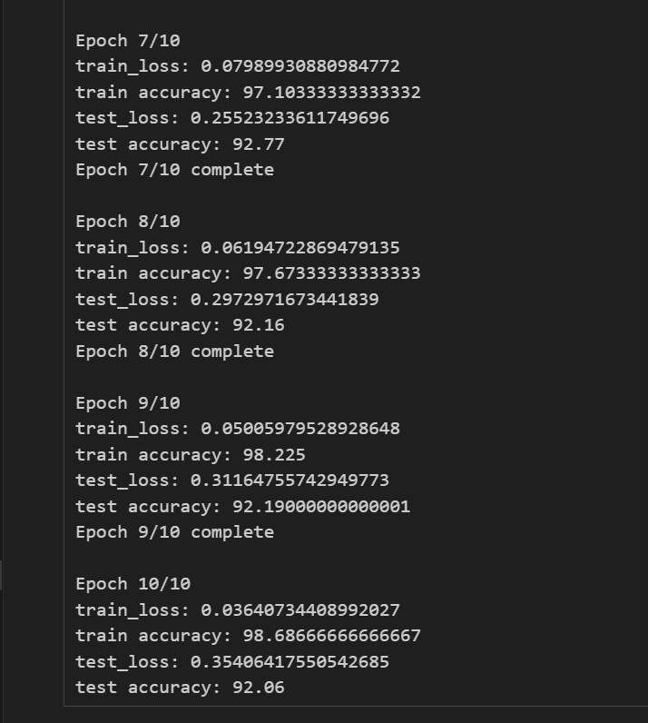

# **FashionMNIST ONNX Classifier**

This project demonstrates a machine learning pipeline for classifying FashionMNIST dataset images using a Convolutional Neural Network (CNN) trained with PyTorch, exported to ONNX format, and deployed in a React-based web application. The deployed application allows users to upload an image, preprocess it, and classify it using the trained ONNX model.

---

## **Live Demo**

You can access the live application here:  
[https://ai-tensor-fashion-mint.vercel.app/](https://ai-tensor-fashion-mint.vercel.app/)

---

## **Contributors**

- **Clément Souplet**  
- **Enzo Givernaud**  
- **Gabriel Dautreppe**  
- **Charles Chrismann**  

---

## **Overview**

### **Jupyter Notebook Workflow**

1. **Dataset Loading and Preprocessing**:
   - The FashionMNIST dataset is loaded using `torchvision.datasets`.
   - Normalization is applied to ensure consistent pixel value ranges.
   - The dataset is split into training and testing sets and visualized using Matplotlib.

2. **Mean and Standard Deviation Calculation**:
   - The mean and standard deviation of the dataset are calculated to fine-tune the normalization process.

3. **Model Architecture**:
   - A Convolutional Neural Network (CNN) is designed with:
     - **Convolutional layers** to extract spatial features.
     - **Fully connected layers** for classification into 10 classes (e.g., T-shirt, trouser, bag).
   - The model is trained on the dataset using the AdamW optimizer and CrossEntropy loss.

4. **Training and Evaluation**:
   - A training loop is implemented to update the model weights.
   - Accuracy and loss metrics are logged using TensorBoard.

   

5. **Model Export to ONNX**:
   - The trained PyTorch model is exported to ONNX format using `torch.onnx.export` for deployment.
   - Dynamic axes are defined for handling variable batch sizes.

6. **Inference with ONNX Runtime**:
   - The exported model is tested with ONNX Runtime to ensure consistency with the PyTorch implementation.

---

### **Frontend: Image Preprocessing and Prediction**

The React web application preprocesses user-uploaded images and passes them to the ONNX model for classification:

1. **Image Upload**:
   - Users can upload an image using an Ant Design file uploader.
   - The uploaded image is displayed for preview.

2. **Image Preprocessing**:
   - The image is resized to **28x28 pixels** and converted to grayscale to match the FashionMNIST dataset format.
   - Pixel values are normalized using the mean and standard deviation calculated during training.

3. **Prediction**:
   - The preprocessed image is converted to a tensor and fed into the ONNX model.
   - The model outputs a probability for each class.
   - The top predictions are displayed with their respective probabilities as percentages.

4. **User Interface**:
   - The probabilities are visually represented with progress bars (Ant Design components).
   - The prediction results are displayed dynamically after inference.

---

## **Technologies Used**

### **Backend**
- **PyTorch**: For training the CNN model.
- **ONNX Runtime**: For running inference with the exported ONNX model.
- **Jupyter Notebook**: For data preprocessing, training, and testing.

### **Frontend**
- **React**: For building the user interface.
- **Ant Design**: For styling and UI components.
- **onnxruntime-web**: For running ONNX models in the browser.

---

## **Key Features**
- **Train Once, Deploy Anywhere**: The model is trained with PyTorch and deployed in the browser using ONNX.
- **Real-Time Inference**: The app processes user-uploaded images and classifies them instantly.
- **Interactive Visualization**: Displays top predictions with probabilities in an intuitive manner.

---

Feel free to explore the application and the codebase! Let us know if you have any feedback. 😊